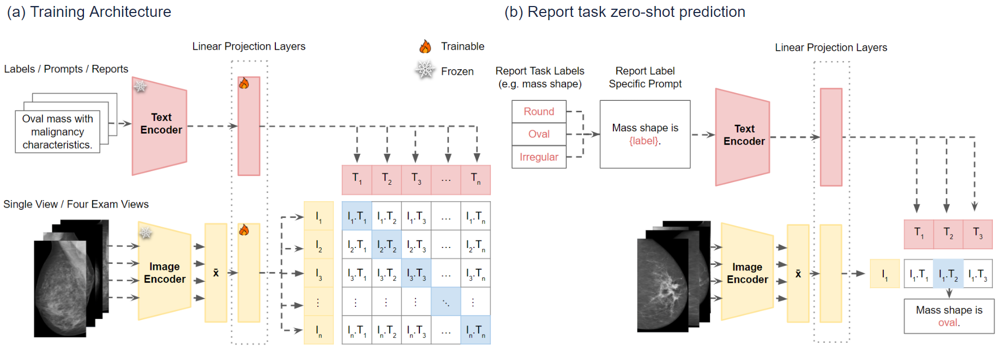
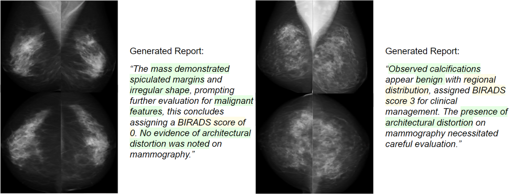

# <h1 align="left">MMG-CLIP: Automated Mammography Reporting Through Image-to-Text Translation</h1>

Recently medical image-text datasets have gained growing utilization in the development of deep learning applications, including automated radiology report generation models. In this work, we tackle the task of automated mammography report generation following Breast Imaging Reporting \& Data System (BI-RADS) guidelines. We utilize an image-label and exam reports datasets, along with text prompting techniques, to generate a well-structured text report that supports training.

## Approach



## Usage
To encode images and extract features:
```python
python encode_images.py --config-name {config_file_name}
```

To create and run a classification experiment:
```python
python train.py --config-name {config_file_name}
```

Example command to run an inference on a trained model:
```python
python evaluate_clip.py --experiment_path "2024-03-18/11-02-49" --run_name "inference"
``` 

Example command to evaluate the CNN image encoder only:
```python
python evaluate_cnn.py 
``` 

For report generation, `experiment_path` is the experiment folder that contains the model checkpoint
```python
# To generate a report at exam level
python generate_report.py --experiment_path "2024-04-29/10-17-33" --exam_id "0200011002"

# To generate a report at image level
python generate_report.py --experiment_path "2024-04-29/10-17-33" --image_id "p0200011002cl"
``` 

To run tensorboard:
```python
tensorboard --logdir=runs
```

Useful scripts:
```python
python mmgclip/utils/count_report_len.py --file_path "outputs/2024-04-10/15-14-53/image_description.txt"
```

## Generated Reports Examples


